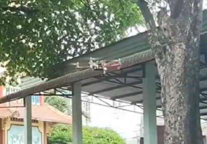
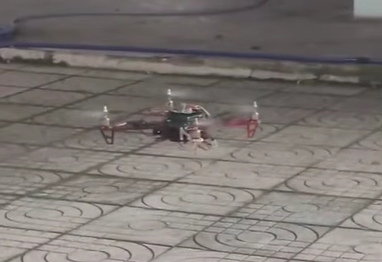
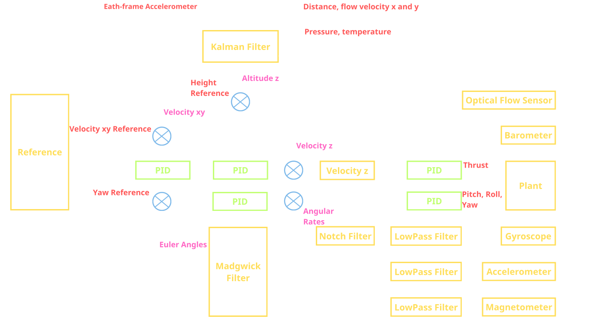
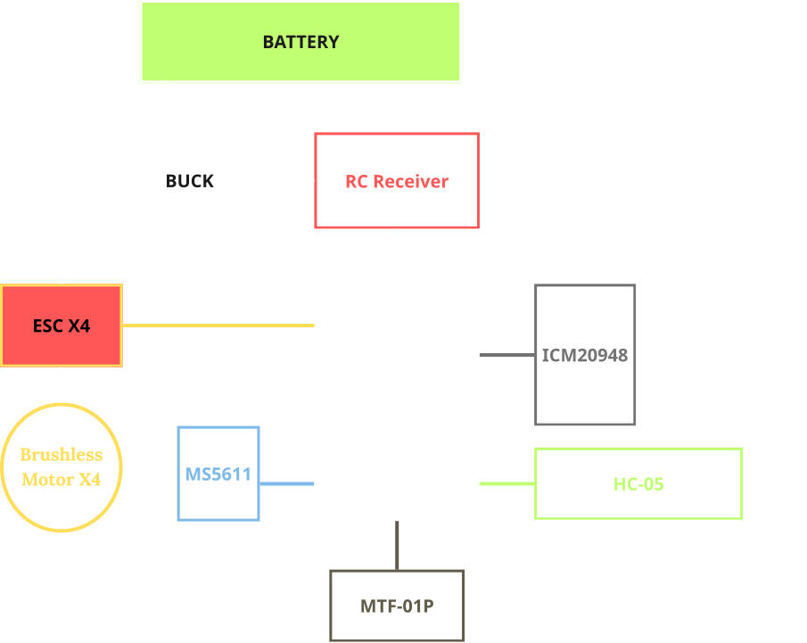

## Feature

* Dedicated for personal research and studying.
* Made from scratch on STM32.
* Simple components that can easily be found.
* Maintains a stable hover position in outdoor environment.
* Position control (planned).

## Result

### Video

 Flight result video: https://youtu.be/znj9OqjzdcU

 Hover video: https://youtube.com/shorts/ZwW649EOINM?feature=share
 
 

 ## Controller Block Diagram

 

## Connection Diagram

  